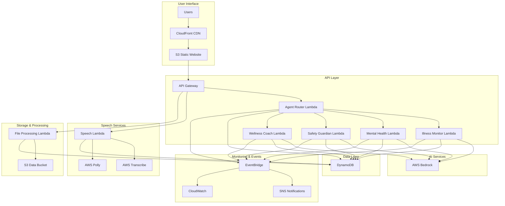

# Design Document

## Overview

This design document outlines the architecture for migrating the Healthcare AI Live2D Unified System from a local Docker-based deployment to a cost-optimized, serverless AWS architecture. The design builds upon the existing CloudFormation template provided by your teammate and focuses on minimizing costs while maintaining all functionality.

**Key Design Principles:**
- **Cost-First Architecture**: Every component uses pay-per-use pricing with near-zero idle costs
- **Serverless-Native**: No always-running servers or containers
- **One-Click Deployment**: Single CloudFormation template deploys everything
- **AWS-Native Services**: Replace all external dependencies with AWS services
- **Minimal Configuration**: Auto-discovery and parameter-based configuration

## Architecture

### High-Level Architecture Diagram



### Cost Optimization Strategy

**Serverless Components (Pay-per-use only):**
- **Lambda Functions**: $0.00 when idle, $0.0000166667 per GB-second when running
- **DynamoDB On-Demand**: $0.00 when idle, $1.25 per million read/write requests
- **API Gateway**: $3.50 per million API calls
- **S3**: $0.023 per GB stored, $0.0004 per 1,000 GET requests
- **CloudFront**: $0.085 per GB transferred (first 10TB)

**Estimated Monthly Costs for Demo Usage:**
- Light usage (100 conversations/day): ~$5-10/month
- Medium usage (500 conversations/day): ~$15-25/month
- Heavy usage (1000 conversations/day): ~$25-40/month

## Components and Interfaces

### 1. Frontend Migration (S3 + CloudFront)

**Current State**: Live2D frontend served by local web server
**Target State**: Static website hosted on S3 with CloudFront CDN

**Implementation**:
```yaml
# S3 Static Website Configuration
Live2DWebsiteBucket:
  Type: AWS::S3::Bucket
  Properties:
    BucketName: !Sub '${Environment}-healthcare-live2d-${AWS::AccountId}'
    WebsiteConfiguration:
      IndexDocument: index.html
      ErrorDocument: error.html
    PublicAccessBlockConfiguration:
      BlockPublicAcls: false
      BlockPublicPolicy: false
      IgnorePublicAcls: false
      RestrictPublicBuckets: false

# CloudFront Distribution for Global CDN
Live2DDistribution:
  Type: AWS::CloudFront::Distribution
  Properties:
    DistributionConfig:
      Origins:
        - DomainName: !GetAtt Live2DWebsiteBucket.RegionalDomainName
          Id: S3Origin
          S3OriginConfig:
            OriginAccessIdentity: ''
      DefaultCacheBehavior:
        TargetOriginId: S3Origin
        ViewerProtocolPolicy: redirect-to-https
        CachePolicyId: 4135ea2d-6df8-44a3-9df3-4b5a84be39ad  # Managed-CachingOptimized
      Enabled: true
      DefaultRootObject: index.html
```

**Interface Changes**:
- Update API endpoints from `localhost:8000` to API Gateway URLs
- Modify asset paths to use CloudFront URLs
- Add environment detection for local vs AWS deployment

### 2. Multi-Agent Lambda Architecture

**Current State**: Single FastAPI application with multiple agent classes
**Target State**: Separate Lambda functions for each agent + router

**Agent Router Lambda**:
```python
# agent_router/handler.py
import json
import boto3
from typing import Dict, Any

lambda_client = boto3.client('lambda')

AGENT_FUNCTIONS = {
    'illness_monitor': f"{os.environ['ENVIRONMENT']}-illness-monitor",
    'mental_health': f"{os.environ['ENVIRONMENT']}-mental-health", 
    'safety_guardian': f"{os.environ['ENVIRONMENT']}-safety-guardian",
    'wellness_coach': f"{os.environ['ENVIRONMENT']}-wellness-coach"
}

def handler(event: Dict[str, Any], context) -> Dict[str, Any]:
    try:
        body = json.loads(event.get('body', '{}'))
        message = body.get('message', '')
        
        # Simple agent routing logic (can be enhanced with AI)
        agent_type = determine_agent_type(message)
        
        # Invoke specific agent Lambda
        response = lambda_client.invoke(
            FunctionName=AGENT_FUNCTIONS[agent_type],
            Payload=json.dumps({
                'message': message,
                'conversation_id': body.get('conversation_id'),
                'user_id': body.get('user_id')
            })
        )
        
        return {
            'statusCode': 200,
            'headers': {'Access-Control-Allow-Origin': '*'},
            'body': response['Payload'].read().decode()
        }
    except Exception as e:
        return {
            'statusCode': 500,
            'body': json.dumps({'error': str(e)})
        }

def determine_agent_type(message: str) -> str:
    # Simple keyword-based routing (replace with AI-based routing)
    message_lower = message.lower()
    if any(word in message_lower for word in ['emergency', '緊急', 'help', '救命']):
        return 'safety_guardian'
    elif any(word in message_lower for word in ['sad', '憂鬱', 'depressed', '心情']):
        return 'mental_health'
    elif any(word in message_lower for word in ['exercise', '運動', 'diet', '飲食']):
        return 'wellness_coach'
    else:
        return 'illness_monitor'  # Default agent
```

**Individual Agent Lambda Structure**:
```python
# illness_monitor/handler.py
import json
import boto3
from typing import Dict, Any

bedrock = boto3.client('bedrock-runtime')
dynamodb = boto3.resource('dynamodb')

def handler(event: Dict[str, Any], context) -> Dict[str, Any]:
    try:
        message = event.get('message', '')
        conversation_id = event.get('conversation_id', 'default')
        
        # Get conversation history from DynamoDB
        history = get_conversation_history(conversation_id)
        
        # Process with AWS Bedrock
        ai_response = process_with_bedrock(message, history)
        
        # Store conversation in DynamoDB
        store_conversation(conversation_id, message, ai_response)
        
        return {
            'statusCode': 200,
            'body': json.dumps({
                'response': ai_response,
                'agent': 'illness_monitor',
                'avatar': 'Hiyori'
            })
        }
    except Exception as e:
        return {
            'statusCode': 500,
            'body': json.dumps({'error': str(e)})
        }
```

### 3. AWS Bedrock Integration

**Current State**: OpenRouter API for AI models
**Target State**: AWS Bedrock with cost-optimized model selection

**Model Selection Strategy**:
```python
# bedrock_client.py
import boto3
from typing import Dict, Any

class BedrockClient:
    def __init__(self):
        self.client = boto3.client('bedrock-runtime')
        
        # Cost-optimized model selection
        self.models = {
            'fast': 'amazon.titan-text-lite-v1',      # Cheapest for simple queries
            'balanced': 'anthropic.claude-3-haiku-20240307-v1:0',  # Good balance
            'advanced': 'anthropic.claude-3-sonnet-20240229-v1:0'  # Most capable
        }
    
    def get_response(self, message: str, agent_type: str, complexity: str = 'balanced') -> str:
        model_id = self.models[complexity]
        
        # Agent-specific prompts
        system_prompts = {
            'illness_monitor': "You are 慧心助手, a caring healthcare assistant...",
            'mental_health': "You are 小星星, a gentle mental health supporter...",
            'safety_guardian': "You are Safety Guardian, an alert emergency responder...",
            'wellness_coach': "You are Wellness Coach, an energetic health educator..."
        }
        
        try:
            response = self.client.invoke_model(
                modelId=model_id,
                body=json.dumps({
                    'anthropic_version': 'bedrock-2023-05-31',
                    'max_tokens': 1000,
                    'system': system_prompts.get(agent_type, ''),
                    'messages': [{'role': 'user', 'content': message}]
                })
            )
            
            result = json.loads(response['body'].read())
            return result['content'][0]['text']
            
        except Exception as e:
            # Fallback to simpler model if advanced model fails
            if complexity != 'fast':
                return self.get_response(message, agent_type, 'fast')
            raise e
```

### 4. DynamoDB Data Model

**Current State**: PostgreSQL with complex relational schema + Redis caching
**Target State**: DynamoDB with denormalized, cost-optimized schema

**Table Design**:
```yaml
# Primary Conversations Table
ConversationsTable:
  Type: AWS::DynamoDB::Table
  Properties:
    TableName: !Sub '${Environment}-healthcare-conversations'
    BillingMode: PAY_PER_REQUEST  # No fixed costs
    AttributeDefinitions:
      - AttributeName: conversation_id
        AttributeType: S
      - AttributeName: timestamp
        AttributeType: S
      - AttributeName: user_id
        AttributeType: S
    KeySchema:
      - AttributeName: conversation_id
        KeyType: HASH
      - AttributeName: timestamp
        KeyType: RANGE
    GlobalSecondaryIndexes:
      - IndexName: UserIndex
        KeySchema:
          - AttributeName: user_id
            KeyType: HASH
          - AttributeName: timestamp
            KeyType: RANGE
        Projection:
          ProjectionType: ALL
    TimeToLiveSpecification:
      AttributeName: ttl
      Enabled: true  # Auto-cleanup old conversations

# User Profiles Table
UserProfilesTable:
  Type: AWS::DynamoDB::Table
  Properties:
    TableName: !Sub '${Environment}-healthcare-users'
    BillingMode: PAY_PER_REQUEST
    AttributeDefinitions:
      - AttributeName: user_id
        AttributeType: S
    KeySchema:
      - AttributeName: user_id
        KeyType: HASH
```

**Data Access Patterns**:
```python
# dynamodb_client.py
import boto3
from datetime import datetime, timedelta
from typing import List, Dict, Any

class DynamoDBClient:
    def __init__(self):
        self.dynamodb = boto3.resource('dynamodb')
        self.conversations_table = self.dynamodb.Table(
            os.environ['CONVERSATIONS_TABLE']
        )
        self.users_table = self.dynamodb.Table(
            os.environ['USERS_TABLE']
        )
    
    def store_conversation(self, conversation_id: str, user_input: str, 
                          ai_response: str, agent_type: str):
        """Store conversation with automatic TTL"""
        self.conversations_table.put_item(
            Item={
                'conversation_id': conversation_id,
                'timestamp': datetime.utcnow().isoformat(),
                'user_input': user_input,
                'ai_response': ai_response,
                'agent_type': agent_type,
                'ttl': int((datetime.utcnow() + timedelta(days=30)).timestamp())
            }
        )
    
    def get_conversation_history(self, conversation_id: str, 
                               limit: int = 10) -> List[Dict[str, Any]]:
        """Get recent conversation history"""
        response = self.conversations_table.query(
            KeyConditionExpression='conversation_id = :cid',
            ExpressionAttributeValues={':cid': conversation_id},
            ScanIndexForward=False,  # Most recent first
            Limit=limit
        )
        return response['Items']
```

### 5. Speech Services Integration

**Current State**: Local TTS/STT processing
**Target State**: AWS Transcribe + Polly with Lambda processing

**Speech Processing Lambda**:
```python
# speech_processor/handler.py
import json
import boto3
import base64
from typing import Dict, Any

transcribe = boto3.client('transcribe')
polly = boto3.client('polly')
s3 = boto3.client('s3')

def handler(event: Dict[str, Any], context) -> Dict[str, Any]:
    try:
        action = event.get('action')  # 'transcribe' or 'synthesize'
        
        if action == 'transcribe':
            return handle_speech_to_text(event)
        elif action == 'synthesize':
            return handle_text_to_speech(event)
        else:
            raise ValueError(f"Unknown action: {action}")
            
    except Exception as e:
        return {
            'statusCode': 500,
            'body': json.dumps({'error': str(e)})
        }

def handle_speech_to_text(event: Dict[str, Any]) -> Dict[str, Any]:
    """Convert speech to text using AWS Transcribe"""
    audio_data = base64.b64decode(event['audio_data'])
    language = event.get('language', 'en-US')
    
    # Upload audio to S3 temporarily
    bucket = os.environ['DATA_BUCKET']
    key = f"temp-audio/{context.aws_request_id}.wav"
    s3.put_object(Bucket=bucket, Key=key, Body=audio_data)
    
    # Start transcription job
    job_name = f"transcribe-{context.aws_request_id}"
    transcribe.start_transcription_job(
        TranscriptionJobName=job_name,
        Media={'MediaFileUri': f's3://{bucket}/{key}'},
        MediaFormat='wav',
        LanguageCode=language
    )
    
    # Wait for completion (or use async pattern)
    # ... implementation details ...
    
    return {
        'statusCode': 200,
        'body': json.dumps({'text': transcribed_text})
    }

def handle_text_to_speech(event: Dict[str, Any]) -> Dict[str, Any]:
    """Convert text to speech using AWS Polly"""
    text = event['text']
    agent_type = event.get('agent_type', 'illness_monitor')
    language = event.get('language', 'en-US')
    
    # Agent-specific voice selection
    voices = {
        'illness_monitor': {'en-US': 'Joanna', 'zh-CN': 'Zhiyu'},
        'mental_health': {'en-US': 'Amy', 'zh-CN': 'Zhiyu'},
        'safety_guardian': {'en-US': 'Matthew', 'zh-CN': 'Kangkang'},
        'wellness_coach': {'en-US': 'Kimberly', 'zh-CN': 'Zhiyu'}
    }
    
    voice_id = voices[agent_type].get(language, 'Joanna')
    
    response = polly.synthesize_speech(
        Text=text,
        OutputFormat='mp3',
        VoiceId=voice_id,
        LanguageCode=language
    )
    
    # Return audio as base64
    audio_data = base64.b64encode(response['AudioStream'].read()).decode()
    
    return {
        'statusCode': 200,
        'body': json.dumps({'audio_data': audio_data})
    }
```

## Data Models

### DynamoDB Schema Design

**Conversations Table**:
```json
{
  "conversation_id": "user123_20241201",
  "timestamp": "2024-12-01T10:30:00Z",
  "user_id": "user123",
  "user_input": "I have a headache",
  "ai_response": "I understand you're experiencing a headache...",
  "agent_type": "illness_monitor",
  "avatar": "Hiyori",
  "language": "en-US",
  "ttl": 1735689000
}
```

**User Profiles Table**:
```json
{
  "user_id": "user123",
  "email": "user@example.com",
  "preferred_language": "zh-HK",
  "preferred_agent": "illness_monitor",
  "created_at": "2024-12-01T10:00:00Z",
  "last_active": "2024-12-01T10:30:00Z",
  "conversation_count": 15
}
```

**Hong Kong Data Cache Table**:
```json
{
  "data_type": "hospital_info",
  "region": "hong_kong",
  "data": {
    "hospitals": [...],
    "emergency_contacts": {...}
  },
  "last_updated": "2024-12-01T08:00:00Z",
  "ttl": 1735689000
}
```

## Error Handling

### Lambda Error Handling Strategy

**Graceful Degradation**:
```python
def handle_ai_request(message: str, agent_type: str) -> Dict[str, Any]:
    try:
        # Try advanced Bedrock model
        return get_bedrock_response(message, agent_type, 'advanced')
    except Exception as e:
        logger.warning(f"Advanced model failed: {e}")
        try:
            # Fallback to balanced model
            return get_bedrock_response(message, agent_type, 'balanced')
        except Exception as e:
            logger.warning(f"Balanced model failed: {e}")
            try:
                # Fallback to fast model
                return get_bedrock_response(message, agent_type, 'fast')
            except Exception as e:
                logger.error(f"All models failed: {e}")
                # Return static fallback response
                return {
                    'response': "I'm sorry, I'm having technical difficulties. Please try again later.",
                    'agent': agent_type,
                    'error': True
                }
```

**DynamoDB Error Handling**:
```python
def store_with_retry(item: Dict[str, Any], max_retries: int = 3):
    for attempt in range(max_retries):
        try:
            table.put_item(Item=item)
            return True
        except ClientError as e:
            if e.response['Error']['Code'] == 'ProvisionedThroughputExceededException':
                # Exponential backoff
                time.sleep(2 ** attempt)
                continue
            else:
                raise e
    return False
```

## Testing Strategy

### Local Development Setup

**Docker Compose for Local Testing**:
```yaml
# docker-compose.test.yml
version: '3.8'
services:
  localstack:
    image: localstack/localstack:latest
    ports:
      - "4566:4566"
    environment:
      - SERVICES=lambda,dynamodb,s3,apigateway
      - DEBUG=1
    volumes:
      - "./aws:/etc/localstack/init/ready.d"
      
  healthcare-test:
    build: .
    environment:
      - AWS_ENDPOINT_URL=http://localstack:4566
      - ENVIRONMENT=test
    depends_on:
      - localstack
```

**Testing Approach**:
1. **Unit Tests**: Test individual Lambda functions with mocked AWS services
2. **Integration Tests**: Test with LocalStack for full AWS simulation
3. **End-to-End Tests**: Test deployed AWS resources with real services
4. **Cost Testing**: Monitor actual AWS costs during testing phase

### Migration Validation

**Side-by-Side Comparison**:
```python
# migration_validator.py
import requests
import json
from typing import Dict, Any

class MigrationValidator:
    def __init__(self, local_url: str, aws_url: str):
        self.local_url = local_url
        self.aws_url = aws_url
    
    def compare_agent_responses(self, test_messages: List[str]) -> Dict[str, Any]:
        results = []
        
        for message in test_messages:
            local_response = self.get_local_response(message)
            aws_response = self.get_aws_response(message)
            
            results.append({
                'message': message,
                'local_response': local_response,
                'aws_response': aws_response,
                'match': self.responses_match(local_response, aws_response)
            })
        
        return {
            'total_tests': len(test_messages),
            'passed': sum(1 for r in results if r['match']),
            'results': results
        }
```

This design provides a comprehensive, cost-optimized migration path that maintains all functionality while leveraging AWS serverless services for minimal operational costs and maximum scalability.